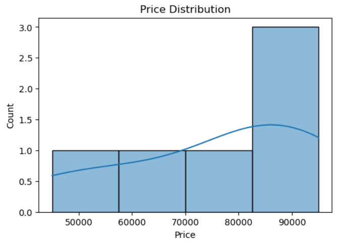
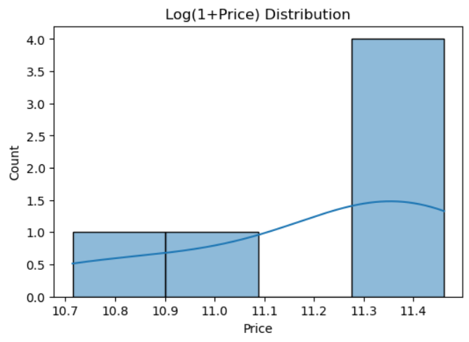
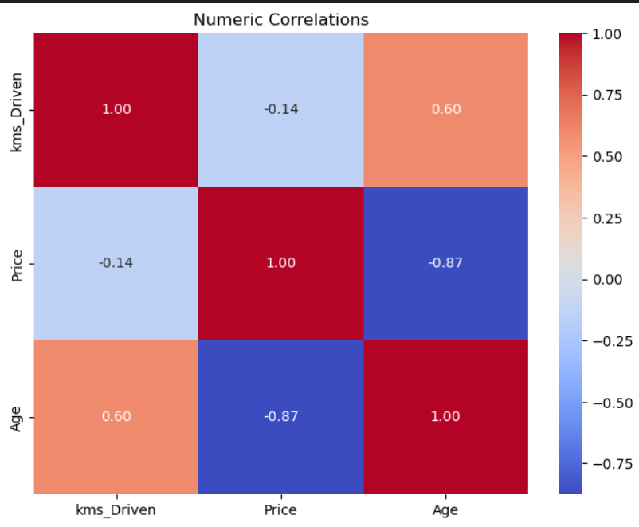
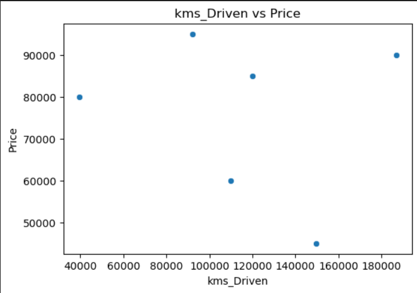
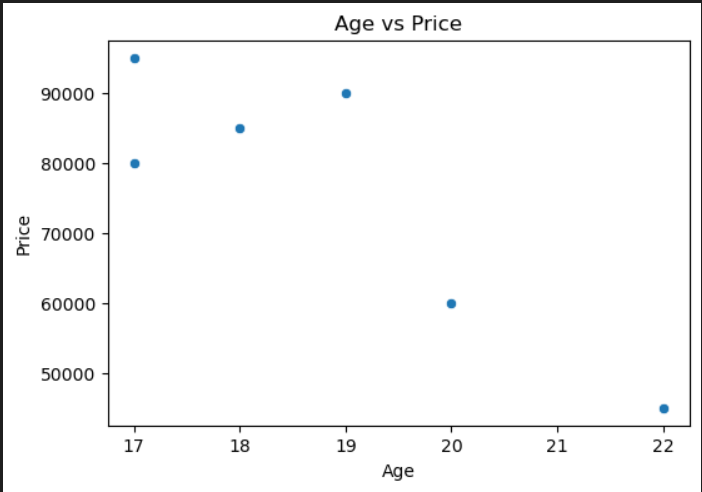

# Car Price Prediction

Car Price Prediction is a machine learning project that predicts used car prices based on vehicle attributes such as year, kilometers driven, fuel type, transmission, owner type, and other structured listing details.

The project applies data cleaning, feature engineering, exploratory data analysis, preprocessing pipelines, model training, cross-validation, and regression model evaluation to estimate used car prices.

---

## Project Overview

Used car prices depend on several factors such as vehicle age, mileage, fuel type, transmission, owner history, and market demand. Manual price estimation can be inconsistent and subjective.

This project uses machine learning to build a data-driven car price prediction model. The goal is to estimate used car prices more accurately using historical listing data and vehicle specifications.

---

## Problem Statement

Estimating the selling price of a used car is challenging because different technical and market-related factors influence the final price.

The objective of this project is to develop a machine learning regression model that predicts used car prices based on structured car listing data.

---

## Objectives

- Analyze used car listing data
- Clean and preprocess raw car data
- Handle missing values and inconsistent entries
- Remove outliers using the IQR method
- Engineer useful features such as car age, log-transformed kilometers, and high-mileage flag
- Perform exploratory data analysis
- Train and compare multiple regression models
- Evaluate models using RMSE, MAE, and R² score
- Select the best-performing model based on evaluation results

---

## Dataset

The dataset used in this project is:

```text
honda_car_selling.csv
```

The dataset contains used car listing details.

### Dataset Features

| Feature | Description |
|---|---|
| Year | Manufacturing year of the car |
| Kms Driven | Total kilometers driven |
| Fuel Type | Type of fuel used by the car |
| Transmission | Manual or automatic transmission |
| Owner Type | Ownership history of the car |
| Price | Target variable representing selling price |

---

## Feature Engineering

Several useful features were created from the original dataset:

| Engineered Feature | Description |
|---|---|
| Age | Calculated as `2025 - Year` |
| log_kms | Log-transformed kilometers driven using `log(1 + Kms Driven)` |
| high_mileage | Binary flag indicating whether a car has high mileage |
| Encoded categorical features | Fuel type, transmission, owner type, and other categorical variables converted using One-Hot Encoding |

---

## Data Preprocessing

The following preprocessing steps were performed:

- Removed unwanted characters from numeric columns
- Converted price and kilometers driven into numeric format
- Handled missing values using median and mode imputation
- Removed duplicate and inconsistent rows
- Removed outliers using the IQR method
- Standardized column names
- Applied One-Hot Encoding for categorical variables
- Scaled numerical features using StandardScaler
- Built preprocessing pipelines to avoid data leakage

---

## Machine Learning Models

The following regression models were trained and compared:

- Linear Regression
- Ridge Regression
- Lasso Regression
- Random Forest Regressor
- HistGradientBoosting Regressor

---

## Model Evaluation

The models were evaluated using:

| Metric | Description |
|---|---|
| MAE | Mean Absolute Error |
| MSE | Mean Squared Error |
| RMSE | Root Mean Square Error |
| R² Score | Measures how well the model explains price variation |

The best-performing model was selected based on RMSE, MAE, and R² score.

---

## Final Model

The final model was selected based on evaluation results from train-test split and cross-validation.

The project demonstrates that machine learning can effectively estimate used car prices by learning patterns from vehicle age, mileage, fuel type, transmission, and ownership-related features.

---

## Tools and Libraries Used

- Python
- Jupyter Notebook
- Pandas
- NumPy
- Matplotlib
- Seaborn
- Scikit-learn

---

## Project Structure

```text
Car-Price-Prediction/
│
├── README.md
├── requirements.txt
├── .gitignore
│
├── data/
│   ├── README.md
│   └── honda_car_selling.csv
│
├── notebooks/
│   ├── README.md
│   └── car_price_prediction.ipynb
│
├── reports/
│   ├── README.md
│   ├── car_price_prediction_report.pdf
│   └── car_price_prediction_presentation.ppt
│
└── images/
    ├── README.md
    ├── price_distribution.png
    ├── log_price_distribution.png
    ├── correlation_heatmap.png
    ├── kms_driven_vs_price.png
    └── age_vs_price.png
```

---

## Key Visualizations

### Price Distribution

This graph shows the distribution of original used car prices in the dataset.



### Log Price Distribution

This graph shows the distribution of car prices after applying log transformation. Log transformation helps reduce skewness and makes the target variable more suitable for regression models.



### Pairwise Correlation Heatmap

This heatmap shows the correlation between numerical features such as kilometers driven, price, and age. It helps identify relationships between variables.



### Kilometers Driven vs Price

This scatter plot shows the relationship between kilometers driven and car price. It helps analyze how mileage affects used car resale value.



### Age vs Price

This scatter plot shows the relationship between car age and selling price. Older cars generally tend to have lower prices.



---

## How to Run Locally

### 1. Clone the repository

```bash
git clone https://github.com/Althafk7171/Car-Price-Prediction.git
cd Car-Price-Prediction
```

### 2. Install required libraries

```bash
pip install -r requirements.txt
```

### 3. Open Jupyter Notebook

```bash
jupyter notebook
```

### 4. Run the notebook

Open:

```text
notebooks/car_price_prediction.ipynb
```

Run all cells to reproduce the analysis and model results.

---

## Results

The project compared Linear Regression, Ridge Regression, Lasso Regression, Random Forest Regressor, and HistGradientBoosting Regressor.

The models were evaluated using RMSE, MAE, and R² score. The best-performing model was selected based on evaluation results and cross-validation performance.

Key factors influencing used car prices include:

- Vehicle age
- Kilometers driven
- Fuel type
- Transmission type
- Ownership history

---

## Reports

This repository includes:

- Final project report
- Project presentation
- Jupyter Notebook
- Dataset
- Visualization images

---

## Limitations

- The model is trained on historical used car listing data.
- Real-time market demand, offers, and location-based pricing are not included.
- The dataset may not include all brands and car models.
- The model performance depends on the quality and size of the dataset.
- The project currently focuses on notebook-based prediction and does not include a deployed web application.

---

## Future Scope

- Deploy the model using Streamlit or Flask
- Add real-time used car market data
- Include more car brands and models
- Add features such as engine power, service history, accident records, and location
- Try advanced boosting models such as XGBoost and CatBoost
- Add hyperparameter tuning
- Build a user-friendly car price prediction web app
- Add feature importance visualization

---

## Contributor

- Muhammed Althaf K

---

## License

This project is developed for academic and learning purposes.

---
